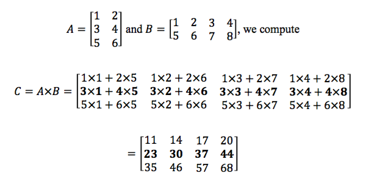

# pmms

##### Operating Systems 200 - Multiprocessing and Multithreading 

##### Purpose

Implementation of a matrix multiplication calculator in C99. The data from the two matrices to mutiply are read from file with the matrix elements being space seperated. The calculator outputs the subtotal of every row, plus the total of all the row subtotals combined. Part A utilizes Multiprocessing and Part B utilizes Multithreading. Shared memory is established via POSIX's shm_open(). Synchronization is ensured via the use of POSIX semaphores, mutexes and conditions.
 
-
##### File List

	.c FILES
	--------
	pmms.c
	fileIO.c

	.h FILES
	--------
	pmms.h
	fileIO.h

	OTHER
	-----
	Makefile
	README.md
	/testFiles
	
-
##### Instructions to Compile + Run

*To Compile:*

	make

*To Run:*

	./pmms [file A] [file B] [M] [N] [K]
	
*To Clean:*

	make clean

*where:*  
  
- file A = Matrix A Filename
- file B = Matrix B Filename
- M = Matrix A Rows
- N = Matrix A Columns / Matrix B Rows
- K = Matrix B Columns	

-
##### Matrix Multiplication

The product matrix C's elements of muliplying matrix A with matrix B is as follows:

	C[i][j] = SUM OF A[i][r] * B[r][j]FROM 1 TO N

The image below illustrates an example of this calculation:

